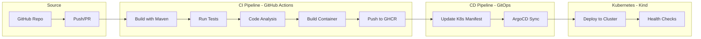

# CI/CD Pipeline Implementation Plan

Production-grade CI/CD pipeline for Task Manager using GitHub Actions, Kind (Kubernetes), and ArgoCD with GitOps principles.

## ✅ Implementation Complete

This plan has been fully implemented. See the [CICD_TUTORIAL.md](docs/CICD_TUTORIAL.md) for detailed setup instructions.

---

## Pipeline Architecture



---

## Directory Structure

```
task-manager/
├── .github/workflows/
│   └── ci.yml                    # CI/CD pipeline
├── argocd/
│   ├── application-dev.yaml      # Dev ArgoCD Application
│   └── application-prod.yaml     # Prod ArgoCD Application
├── kustomize/
│   ├── base/
│   │   ├── kustomization.yaml    # Base config
│   │   ├── namespace.yaml
│   │   ├── app-deployment.yaml   # App + Service
│   │   ├── postgres.yaml         # DB + Service + PVC
│   │   └── config.yaml           # ConfigMap + Secrets
│   └── overlays/
│       ├── dev/
│       │   ├── kustomization.yaml
│       │   └── patches.yaml      # 1 replica, low resources
│       └── prod/
│           ├── kustomization.yaml
│           └── patches.yaml      # 3 replicas, high resources
├── scripts/
│   ├── setup-cluster.ps1         # Windows setup
│   └── setup-cluster.sh          # Linux/Mac setup
└── kind-config.yaml              # Kind cluster config
```

---

## Environment Comparison

| Setting | Dev | Prod |
|---------|-----|------|
| Replicas | 1 | 3 |
| Memory | 256Mi-512Mi | 512Mi-1Gi |
| CPU | 100m-250m | 250m-1000m |
| PVC | 1Gi | 10Gi |
| SQL Logging | ON | OFF |
| ArgoCD App | task-manager-dev | task-manager-prod |

---

## Quick Start

```powershell
# Windows - Deploy dev environment
.\scripts\setup-cluster.ps1

# Windows - Deploy prod environment
.\scripts\setup-cluster.ps1 prod

# Create GHCR secret
kubectl create secret docker-registry ghcr-secret `
  --docker-server=ghcr.io `
  --docker-username=AaronCallanga `
  --docker-password=YOUR_PAT `
  -n task-manager
```

---

## Access Points

| Service | URL |
|---------|-----|
| Task Manager API | http://localhost:30080/api/tasks |
| ArgoCD UI | https://localhost:30081 |
